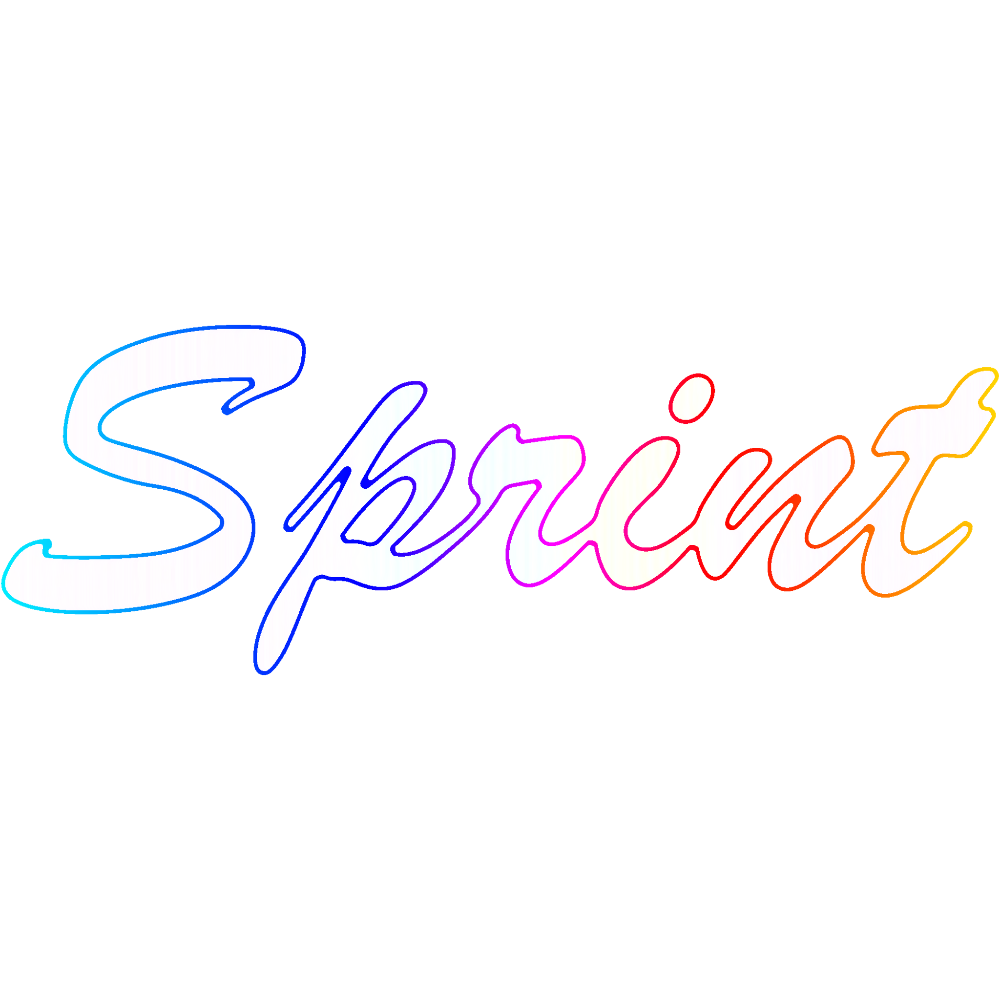
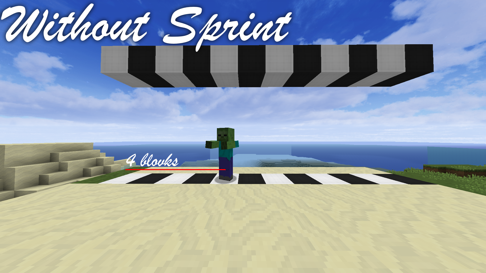
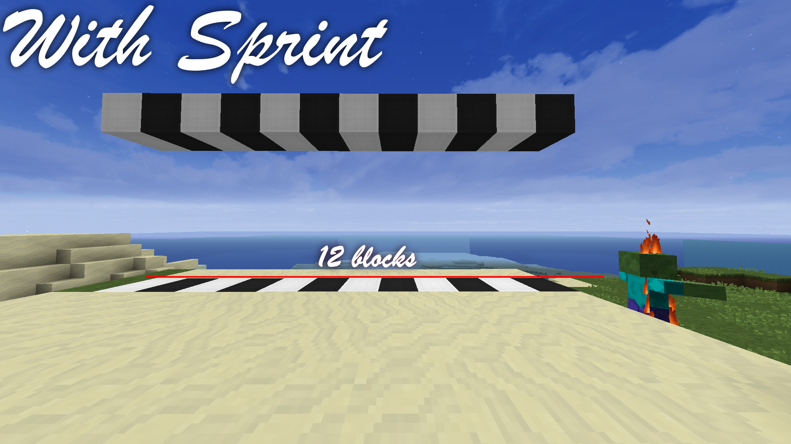

Sprint is a toggleable sprint mod designed to be actually usable, intuitive, and configurable. It supports a million different colours,
along with a never-before-seen per-character chroma feature, unlike other popular mods which only provide a maximum of one colour per
character.

Sprint has a movable indicator with configurable text, and is designed to look beautiful in the configuration you want.

## Sounds great. How do I use it?

To get the latest features, you can compile this repository yourself.
You can also check the Releases tab, if there happen to be any new releases that I've compiled specifically for you :)

#### Compiling it yourself

Prerequisites:
 - Java 8
 - Internet access
 - Motivation

1. **Download the repository** either via `git clone` or, on GitHub, the big green `Code` button and then the `Download ZIP` button
2. **Extract the downloaded archive** if needed.
3. **Open PowerShell or a Terminal**.
4. In the newly opened powershell or terminal, **type `./gradlew clean build` and press Enter.**
5. Once you see the big `BUILD SUCCESSFUL` text, **get your mod file from the `build/libs` directory.**

#### Help, I don't use an archaic version of Java!

If you're smart enough to not use Java 8, you're smart enough to modify the gradlew script yourself.

## Screenshots

## I've found a bug! How do I report it?

It's very simple! Just go to the [Issues](https://github.com/bluelhf/Sprint/issues) tab and create a new issue!
